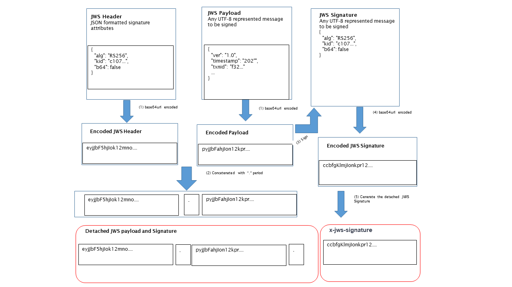

# Annexure B – Application Layer Security – JWS Signature

### Cryptographic Standard algorithms: JSON Web Signature \(JWS\)

#### JWS Protected Header

**Description**: Produce JWS header parameters which define how the signature is created

| Claims | Mandatory\(M\)/ Optional\(O\) | Description |
| :--- | :--- | :--- |
| "b64":" false | M | Determines whether payload data is b64 encoded or not. |
| “kid”: "…." | M | Determine the signer certificate to verify the signature |
| "x5t\#S256": "…." | O | Hash of signing certificate. It means digest of the X.509 signing certificate using SHA 256. |
| "crit":\["b64"\] | O | Non-standard \(i.e., not defined in RFC 7515\) JWS header parameters which are critical |
| "alg": "RS256" | M | Signature algorithm |

Note: This is shown below in a pretty print layout.  It will be sent as a single string without line brakes or extra spaces.  Escape characters are not used.

**Disclaimer**: These examples should not be taken as reference point for implementations of the AA JWS profile. They are based on a single implementation and have not been tested for correctness against other implementations.

#### 
JSON Web Signature Standard Algorithm

**Note:** RS256 is the currently adopted algorithm by all AAs for interoperability purpose.

| "alg" Param | Digital Signature or MAC Algorithm | Implementation Requirements |
| :--- | :--- | :--- |
| HS256 | HMAC using SHA-256 | Required |
| HS384 | HMAC using SHA-384 | Optional |
| HS512 | MAC using SHA-512 | Optional |
| RS256 | RSASSA-PKCS1-v1\_5 using SHA 256 | Recommended |
| RS384 | RSASSA-PKCS1-v1\_5 using SHA 384 | Optional |
| RS512 | RSASSA-PKCS1-v1\_5 using SHA 512 | Optional |
| ES256 | ECDSA using P-256 and SHA-256 | Recommended |
| ES384 | ECDSA using P-256 and SHA-384 | Optional |
| ES512 | ECDSA using P-256 and SHA-512 | Optional |

