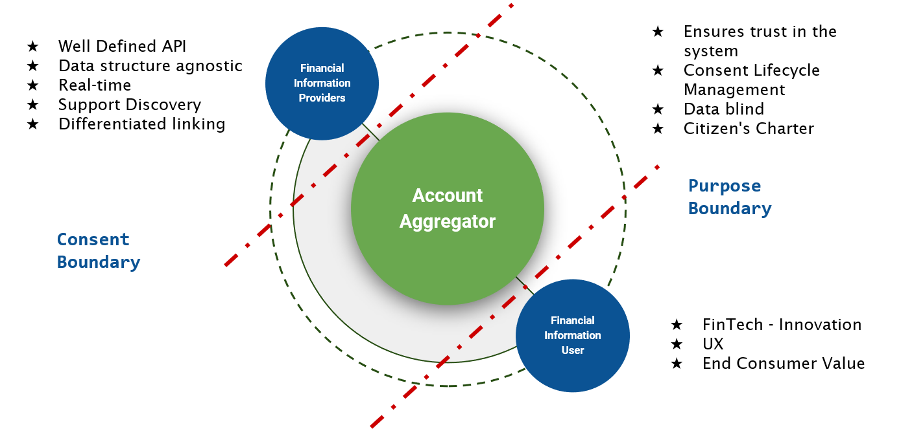
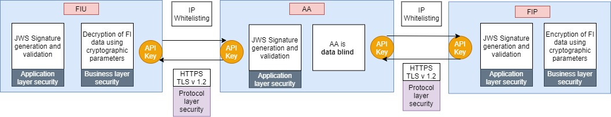
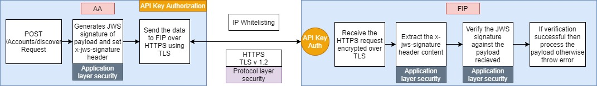
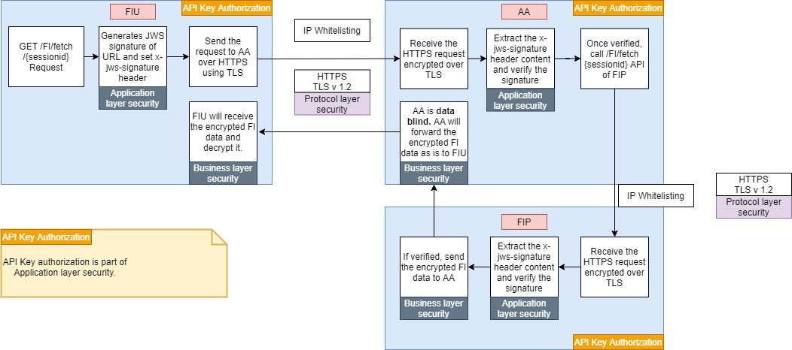

# Background

The NBFC-AA ecosystem is a **technology led inter-regulatory policy initiative** and enables new class of regulated entity that manages “**Electronic Consent**” and facilitates “**exchange of financial data**” in a secured manner by adopting industry standard security and implementation best practices. It is a multi-stakeholder complex system - FIP, AA and FIU - enabling the ecosystem and policy transmission. It enables sharing of financial information from the Financial Information Provider \(FIP\) to the Financial Information Provider \(FIU\) through Account Aggregator \(AA\) on the basis of Customer’s consent. The design of AA ecosystem API is based on the following principles:

* Should be generic in nature and aim at smooth and secure flow of electronic data across different stakeholders.
* Should be reliable.
* Should not prescribe any specific choice of technology or platform.
* Should ensure that robust data governance standards are adopted.

Additionally, the privacy by design principles and measures have been incorporated in the API design. A Consent Framework has been designed that put users in control of their FI data that is shared between FIP and FIU via AA. It also creates access boundary where FIU is restricted with the purpose boundary and FIP is allowed to exchange the FI as per consent boundary. The purpose boundary defined the scope of processing the financial information for providing the value-added service to the customer. In other part, the consent boundary defined a data access controls \(such as digital signature, FI data range, validity of consent etc.\) that should be validating against each FI request. This layered boundary based on consent framework in AA ecosystem offers various advantages corresponding to AA, FIP, and FIU as shown in below figure.

These security and privacy measures enable the API to carry personal and sensitive data in secure and reliable manner.

To achieve the security and privacy principles in AA ecosystem, the participating entities should implement the layered security model as depicted in the below Figure.

The different security layers are:

1. **Business layer security**
   1. AA data blind and transient storage
   2. Consent artefact: creation, management, and validation
2. **Application layer security**
   1. Validation of the digital signature of the payload or URI parameter using JWS.
   2. API Key
   3. IP Whitelisting
3. **Protocol layer security**
   1. TLS v1.2 over HTTPS

The illustrative process of implementing layered security protocol for AA ecosystem as follows:

1. **Protocol layer and application layer security process flow:**

All APIs in AA ecosystem should implement protocol and application layer security.

**Protocol, Application and Business layer security:**

The Business layer security is applicable only during the FI data fetch request. In this process, the FIP encrypts the financial information using E2EE so that intermediate points \(AA\) cannot decrypt the data.

For instance:

Apart from implementing the layered security model, the participating entities should consider the best security practices for implementing the AA ecosystem APIs:

* Handbook on application programming interfaces \(APIs\)[\[3\]]() by IDRBT
* OWASP API security top 10[\[4\]]()
* ISO/TS 23029:2020\(en\) Web-service-based application programming interface \(WAPI\) in financial services[\[5\]]()
* JSON web token best current practices[\[6\]]()
* The Transport Layer Security \(TLS\) Protocol Version 1.2[\[7\]]()

The NBFC-AA APIs security needs to define the domain of control that consists of the following components to support the API security:

* Registration for application developer to access the API.
* Only authenticated and authorized application \(or API consumer\) access to the API.
* An API producer and the consumer should ensure confidentiality and integrity of the data during the communication between them and also ensure the non-repudiation of their activity.
* The proposed solution should overcome replay attack, man-in-the-middle attack, DDoS attack, etc.

This document describes the detailed approach of robust industry standard API security policies and practices adopted in the AA ecosystem for achieving the API performance, scalability, interoperability and for sharing and storing the financial data in a secured manner.

